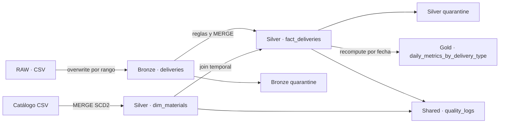

# SAAS Data Platform

Implementación local, portable a Databricks, de un pipeline medallion multi-tenant para entregas de producto. Cada tenant se procesa y almacena de forma aislada; los controles de calidad se consolidan en una tabla Delta compartida.

## Arquitectura



Capas y tablas principales:

- **Bronze:** conserva las columnas del CSV y agrega `_ingestion_timestamp`, `_source_file`, `_tenant_id`, `_batch_id` y `_record_hash`.
- **Silver:** normaliza cantidades a ST, aplica anomalías, mantiene `dim_materials` SCD2 y enriquece los hechos con la versión vigente en la fecha de negocio.
- **Gold:** agrega por tenant, fecha y tipo de entrega usando el precio transaccional.
- **Shared:** registra cada check con severidad, conteos, `run_id` y `batch_id`.

## Requisitos y versiones

- Python 3.11
- JDK 17 (`JAVA_HOME` configurado)
- [uv](https://docs.astral.sh/uv/)
- PySpark 3.5.1
- Delta Lake / `delta-spark` 3.2.0
- OmegaConf 2.3.0

El primer inicio de una sesión Delta descarga los JAR de Delta Lake desde Maven. Por eso requiere conectividad una vez, salvo que ya estén en el caché de Ivy.

## Preparación

```bash
uv sync --all-groups
```

En Windows PowerShell:

```powershell
$env:JAVA_HOME = "C:\Program Files\Eclipse Adoptium\jdk-17..."
$env:PATH = "$env:JAVA_HOME\bin;$env:PATH"
uv sync --all-groups
uv run python scripts/download_delta_jars.py
uv run python scripts/bootstrap_windows_hadoop.py
```

Los últimos dos comandos preparan el runtime local de Windows: descargan los JAR de Delta y los binarios Hadoop 3.3.6 que PySpark necesita para permisos del filesystem. Los binarios vienen del repositorio público [`cdarlint/winutils`](https://github.com/cdarlint/winutils), se verifican contra SHA-256 fijados y nunca se versionan. Linux y Databricks usan la resolución estándar de `delta-spark` y no requieren `winutils`.

Los CSV entregados están versionados en `input/`. Los productos Delta se crean debajo de `data/` y están excluidos de Git.

La ejecución validada en este repositorio usa rutas locales, tal como pide la simulación del challenge. En Databricks, el código reutiliza la SparkSession del runtime y los paths deben sobreescribirse con rutas gobernadas `/Volumes/...` o ubicaciones cloud definidas por la plataforma; no se fuerza el `master` local.

## Ejecución

Todos los tenants y el rango completo:

```bash
uv run saas-pipeline run \
  --env dev \
  --tenant all \
  --start-date 2025-01-01 \
  --end-date 2025-06-30
```

Un solo tenant:

```bash
uv run saas-pipeline run --env dev --tenant sv --start-date 2025-03-01 --end-date 2025-03-31
```

Opciones relevantes:

- `--env dev|qa|main`: aplica el YAML del ambiente.
- `--tenant <código>|all`: procesa un tenant o la lista `tenants.enabled`.
- `--fail-fast` / `--no-fail-fast`: sobreescribe el comportamiento configurado para corridas multi-tenant.
- `--project-root`: permite ejecutar la CLI fuera de la raíz del repositorio.

La CLI devuelve código distinto de cero si algún tenant falla e imprime un resumen JSON por tenant. Con `fail_fast: false`, los demás tenants continúan.

## Idempotencia y anomalías

- Bronze reemplaza atómicamente el rango solicitado mediante `replaceWhere`.
- `fact_deliveries` ejecuta `MERGE` con la clave definida por la arquitectura.
- `dim_materials` ejecuta `MERGE` por `(material, valid_from)`.
- Gold reemplaza el rango derivado; nunca es fuente autoritativa.
- Cuarentena usa un hash de las columnas fuente más el motivo, por lo que un reproceso actualiza el registro en lugar de duplicarlo.
- Duplicados exactos se eliminan; tipos de entrega no admitidos se contabilizan y descartan; fechas, precios, cantidades o materiales inválidos se conservan en cuarentena.

El aislamiento local está representado por rutas independientes:

```text
data/dev/bronze/<tenant>/deliveries/fecha_proceso=YYYYMMDD/_tenant_id=<tenant>/
data/dev/silver/<tenant>/fact_deliveries/fecha_proceso=YYYY-MM-DD/
data/dev/silver/<tenant>/dim_materials/
data/dev/gold/<tenant>/daily_metrics_by_delivery_type/fecha_proceso=YYYY-MM-DD/
data/dev/{bronze|silver}_quarantine/<tenant>/<table>/
data/dev/shared/quality_logs/
```

## Calidad y pruebas

```bash
uv run ruff check .
uv run pytest --ignore=tests/integration --cov=saas_pipeline
uv run pytest tests/integration
```

Los checks Silver verifican cantidad positiva, tipos permitidos, enriquecimiento material, unicidad de la clave de negocio y consistencia básica SCD2. Todos se escriben en `quality_logs`. En QA y main, una falla crítica impide construir Gold.

GitHub Actions ejecuta linter, carga de configuración y pruebas de transformaciones en cada push y pull request. El workflow instala JDK 17, por lo que no depende del JDK del runner.

## Estructura del repositorio

```text
config/                 configuración base, ambientes y tenants
docs/                   infraestructura, observaciones y onboarding
input/                  datos fuente de la prueba
mentoring/              código original, refactor y revisión
src/saas_pipeline/      pipeline y CLI
tests/                  pruebas unitarias
.github/workflows/      CI
```

## Onboarding de un tenant

El procedimiento detallado está en [`docs/onboarding-tenant.md`](docs/onboarding-tenant.md). En síntesis: crear el YAML del tenant, agregar su código a `tenants.enabled`, provisionar schemas/rutas/grants y ejecutar primero un rango acotado con las validaciones críticas activas. No se modifica código de transformación.

## Decisiones y alcance

Las ambigüedades y desacuerdos con la arquitectura provista están documentados en [`docs/observations.md`](docs/observations.md), sin alterar unilateralmente el contrato solicitado.

### Qué dejé fuera y por qué

- Auto Loader/streaming, dashboard y una segunda tabla Gold: son bonus y no mejoran la evidencia del camino crítico.
- Terraform ejecutable contra cloud: faltan credenciales y datos concretos de la cuenta; [`docs/infra.md`](docs/infra.md) incluye el snippet solicitado y sus recursos.
- Unity Catalog real: el aislamiento se simula con paths locales como pide la prueba.
- Deletes de Silver ante desaparición de una clave en la fuente: la arquitectura prescribe `MERGE` update/insert; el riesgo y una alternativa están registrados en observaciones.
